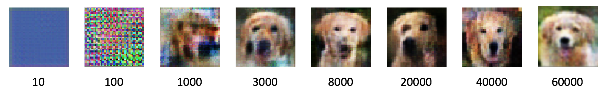
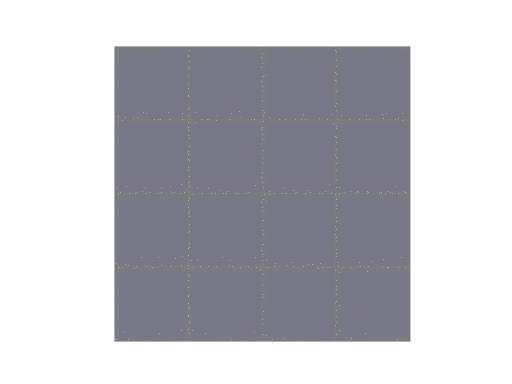

### Deep-Convolutional Generative Adversarial Networks

This project is the framework for creating a DC-GAN which uses a training set of images to start creating new content from what it has been supplied with.

#### Launching a new Environment
The following command will launch an environment with the relevant dependencies:
```
conda env create -f environment.yml -n dc-gan
```
Once created the new environment can be activated and deactivated using the following commands:
```
source activate dc-gan
source deactivate
```
The final command will launch a new intsance of iPython Notebooks in the environment:
```
jupyter notebook
```
To remove the environment after deactivation run the following:
```
conda env remove -n dc-gan
```

#### Example Usage
Supplying the framework with the training dog images supplied can expect to produce results similar to the following:


An animated gif of the progression is shown below:

